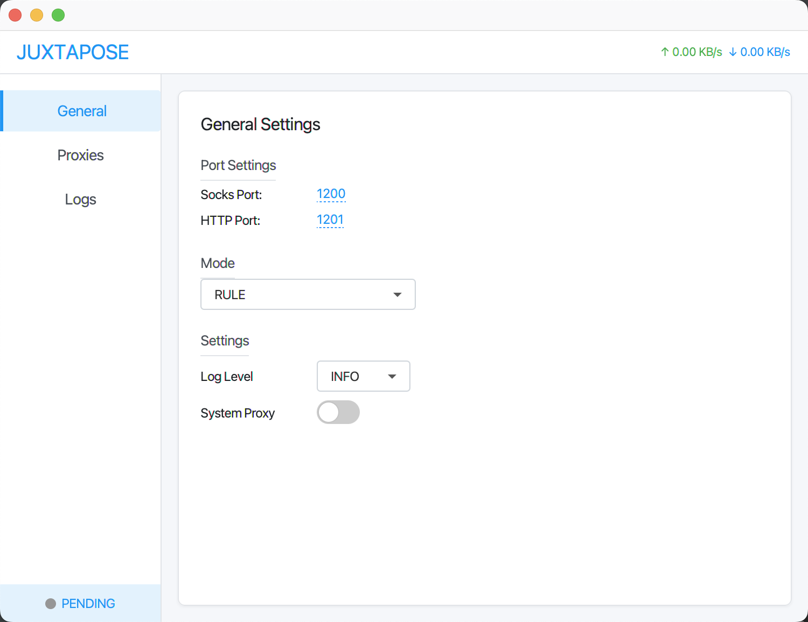

# Juxtapose
Juxtapose是一款持续迭代中的代理（proxy）软件，目前主要协议支持HTTP和Socks5。界面如图：



## 部署
执行`sh install.sh`, 在target目录下会出现client和server包。server端运行在代理服务器上，client则运行在本地。

client运行:
```
修改conf目录下的proxy_servers.yaml配置，修改器代理节点（server端）

windows: 双击startup_client.cmd
mac: sh startup_client.sh
```

server运行:
```
sh startup_server.sh
```

## 架构


## 迭代中的功能与建议
建议：

~~添加身份验证和授权机制~~
~~实现TLS/SSL加密通信~~
添加流量限制和防滥用措施
考虑添加数据加密功能 
可扩展性改进
   现状：项目有组件和模块的概念，但可能缺乏插件机制。

建议：

实现插件系统，支持动态加载新功能
设计更灵活的协议适配器，支持更多协议
考虑使用事件驱动架构，提高系统响应性
性能优化
   现状：项目使用Netty进行网络通信，有一定的性能保障。

建议：

实现连接池管理，优化资源使用
添加缓存机制，减少重复计算
考虑使用异步非阻塞IO处理更多并发连接
实现负载均衡和集群支持


UDP的支持
多平台的支持、多平台的IO模型可选择
~~数据传输加密
客户端的链接管理，代理链接管理~~

需要支持的类型：重点支持VMess、Socks5、HTTP
协议类型	type 值	核心参数	传输层支持
Shadowsocks	ss	cipher, password	TCP/UDP
VMess	vmess	uuid, alterId, network	TCP/WebSocket
Trojan	trojan	password, sni	TCP
~~SOCKS5	socks5	username, password	TCP/UDP
HTTP(S)
以及用户自定义协议~~

~~1.设置系统代理,  参照：https://myth.cx/p/windows-proxy/~~
~~2.域名ip库geoip
3.rule规则模式（黑、白名单）~~、script
4.VMess协议的支持
~~5.客户端界面~~
6.空闲检测
7.优化日志加载打印（会卡主界面，日志一多。。）
~~8.自动加载rule和profile配置~~