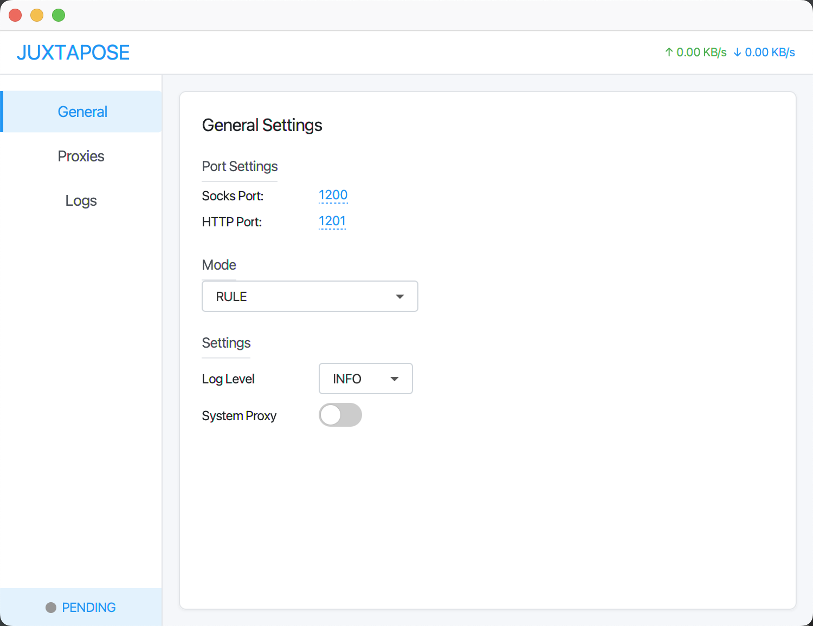

# Juxtapose
Juxtapose是一款持续迭代中的代理（proxy）软件，目前主要协议支持HTTP和Socks5。界面如图：



## 架构


## 迭代中的功能
- [x] 身份验证和授权机制
- [x] 私有证书TLS加密通信
- [x] 代理连接管理
- [x] 本地系统代理设置，参照：https://myth.cx/p/windows-proxy
- [x] 域名ip库GEOIP支持
- [x] 支持Rule规则模式（可配置）、本地直连模式、全局代理模式
- [x] 客户端UI
- [x] 代理组，代理组节点选择策略
- [x] 空闲检测、水位线控制（流量控制）
- [x] 支持HTTP协议
- [x] 支持Socks5协议
- [x] 支持自定义协议
- [x] 支持多平台的IO模型
- [ ] 支持UDP
- [ ] 服务端建立命令Web端，支持客户端与其命令交互（连接关闭、鉴权认证...）
- [ ] 更多的协议（Vmess、Shadowsocks、Trojan...）
- [ ] 插件系统
- [ ] 公有证书加密的支持
- [ ] ...


## 部署&运行
> 注意：JDK开发版本为1.8.0_441。由于UI界面使用的是JavaFx，所以需要采用包含JavaFx包的JDK版本，运行机器上需要部署JDK8。

### 打包：

执行`sh install.sh`, 在target目录下会出现client和server包。server端运行在代理服务器上，client则运行在本地。


### server运行:
server段配置一般只需要更改proxy.proto协议类型，协议类型支持：JUXTA/HTTP/Socks5：
```
# log config
logging.config=${JUXTAPOSE_HOME}/conf/logback.xml
logging.level=INFO

[ProxyServer]
proxy.proto=JUXTA
proxy.host=0.0.0.0
proxy.port=2201
proxy.auth=true
proxy.tls=true
proxy.username=root
proxy.password=root

[Encrypt] # tls加密
encrypt.method=pem 
encrypt.server.port=2202
```
> 注意：目前客户端与服务端之间的加密是采用的TLS，但是证书是使用的私有证书，存放在conf目录，如果有需要可以自行修改

运行：
```
sh startup_server.sh
```

### client运行:

修改conf目录下的proxy_servers.yaml配置，修改代理节点ip、port等信息，比如：
```
proxies:
  - name: testnode
    server: 127.0.0.1
    port: 2201
    tls: true
    type: JUXTA
    username: root
    password: root

proxy-groups:
  - name: Default
    proxies:
      - testnode
    type: select
```
解释：定义了一个叫做testnode使用JUXTA协议的代理节点（每个节点对应一个server端），并且Default组包含了该节点，且Default组使用select选择策略，表明需要用户自己选择代理节点。

| 字段                 | 值                                                                                                        | 注释                                                                           |
|:-------------------|:---------------------------------------------------------------------------------------------------------|:-----------------------------------------------------------------------------|
| proxies.type       | JUXTA/HTTP                                                                                               | 表明与代理节点通信是什么协议，优先使用JUXTA（自定义协议），目前HTTP暂时还有些小bug                              |
| proxy-groups.type  | select：用户手动选择节点<br/>url-test：组内自动选择延迟最低的节点<br/>fallback：按顺序尝试节点，使用第一个可用的节点<br/>load-balance：在可用节点间进行负载均衡 | 组的选择节点策略, 表示组内的节点使用什么策略选取使用                                                  |

> 注意：Default组是rule模式下没有匹配到任何规则的情况下最终默认匹配的组，如果需要修改，那么同时需要修改proxy_rules.yaml配置里的规则。
> 
>看到这里如果熟悉clashwindows的话，那么肯定能发现proxies的定义是直接搬的clashwindows😂

客户端运行：
```
Windows: 双击startup_client.cmd
MacOS: sh startup_client.sh
```
在界面出现后打开System Proxy即可使用


